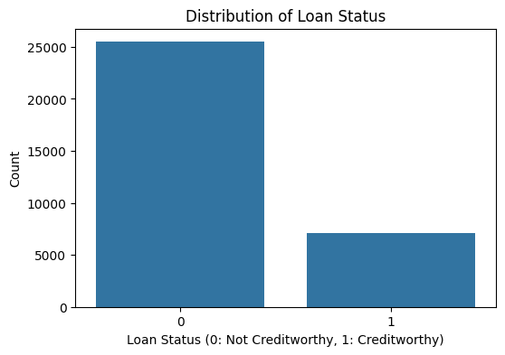
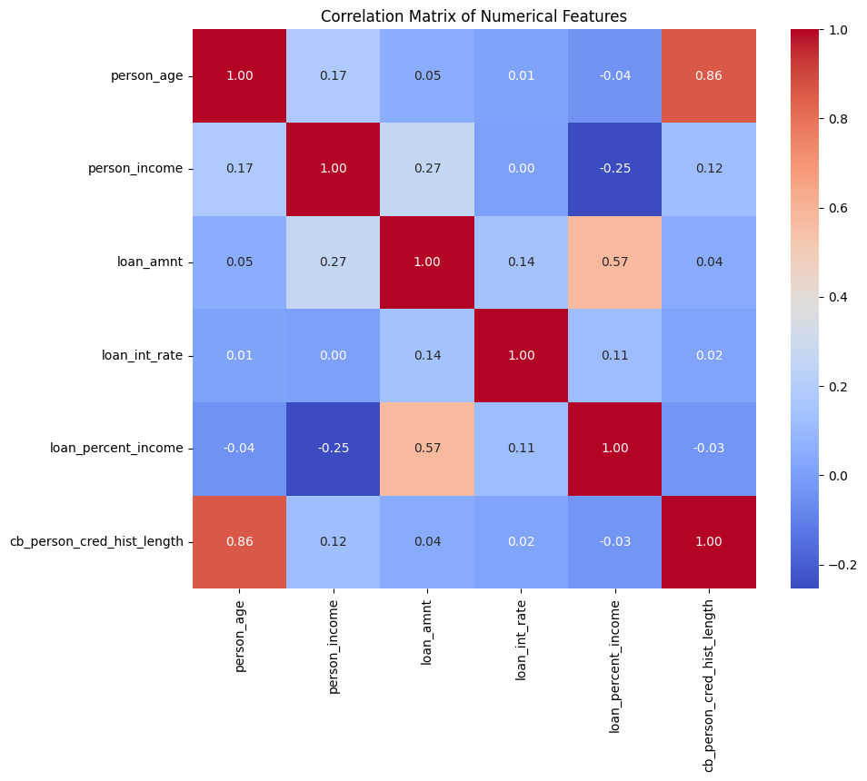
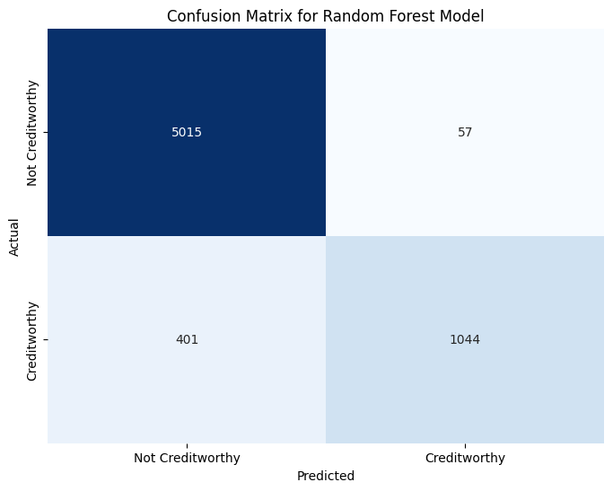

# 🏦 Credit Scoring Model — CodeAlpha Internship Project

## 🎯 Objective  
Predict an individual's **creditworthiness** using past financial data. The goal is to classify whether a person is likely to **default on a loan** or not, based on historical and demographic features.

---

## 🧠 Project Overview  
This project uses **machine learning classification algorithms** to build a credit scoring model.  
The dataset used is from Kaggle:  
[Credit Risk Dataset](https://www.kaggle.com/datasets/laotse/credit-risk-dataset)

---

## ⚙️ Approach  

### **1. Data Preprocessing**
- Handled missing values in:
  - `person_emp_length` and `loan_int_rate` (imputed with median)
- One-hot encoded categorical features  
- Scaled numerical features using `StandardScaler`

### **2. Feature Engineering**
Created new derived features:
- `debt_to_income_ratio` = `loan_amnt / person_income`
- `long_credit_history` = 1 if `cb_preson_cred_hist_length` > 10 years else 0  
- `age_to_employment_ratio` = `person_age / person_emp_length` (handled division by zero)

### **3. Data Splitting**
- Train-test split: **80% training, 20% testing**

### **4. Model Training**
Trained and evaluated three models:
| Model | Accuracy | Precision | Recall | F1-Score | ROC-AUC |
|--------|-----------|------------|---------|-----------|----------|
| Logistic Regression | 0.86 | 0.8920 | 0.7325 | 0.8032 | 0.8654 |
| Decision Tree | 0.89 | 0.9183 | **0.7758** | 0.8412 | 0.9010 |
| **Random Forest** | **0.93** | **0.9482** | 0.7609 | **0.8201** | **0.9371** |

### **5. Model Selection**
The **Random Forest** model achieved the best overall performance across all key metrics and was selected as the final model.

---

## 📊 Visualizations

1. **Distribution of Target Variable**
   - Visualizes the class balance of loan default (`loan_status`)

   

2. **Distribution of Numerical Features**
   - Visual comparison of key numerical features like `person_age`, `person_income`, and `loan_amnt`

   

3. **Correlation Matrix**
   - Displays feature relationships and their correlations with the target variable

   

4. **Confusion Matrix**
   - Shows the model’s classification results for the test set

   

---

## 🔍 Key Findings
- Random Forest achieved **highest accuracy (93%)** and **best ROC-AUC (0.9371)**.  
- Decision Tree gave **highest recall**, useful when minimizing false negatives.  
- The most important features (based on feature importance) include:
  - `loan_int_rate`
  - `loan_amnt`
  - `person_income`
  - `cb_preson_cred_hist_length`

---

## 🚀 Insights & Next Steps
- Further **hyperparameter tuning** may enhance Random Forest performance.
- **Feature importance analysis** provides interpretable insights into drivers of creditworthiness.
- Potential next steps:
  - Deploy model using **Flask/Streamlit**
  - Integrate model into a **credit risk decision system**

---

## 🧾 Dataset Description

| Feature | Description |
|----------|-------------|
| `person_age` | Age of the applicant |
| `person_income` | Annual income |
| `person_home_ownership` | Type of home ownership |
| `person_emp_length` | Employment length (in years) |
| `loan_intent` | Purpose of the loan |
| `loan_grade` | Grade assigned to the loan |
| `loan_amnt` | Loan amount |
| `loan_int_rate` | Interest rate |
| `loan_status` | Loan status (0 = non-default, 1 = default) |
| `loan_percent_income` | Percentage of income used for the loan |
| `cb_person_default_on_file` | Historical default record |
| `cb_preson_cred_hist_length` | Length of credit history |

---

## 🧩 Technologies Used
- **Python**
- **Pandas**, **NumPy**
- **Matplotlib**, **Seaborn**
- **Scikit-learn**

---

## 📈 Evaluation Metrics
- **Accuracy**
- **Precision**
- **Recall**
- **F1-Score**
- **ROC-AUC**

---

## 🧑‍💻 Author
**Md. Fahad Hasan**  
CodeAlpha Internship Project  
GitHub: [fahadhasan93](https://github.com/fahadhasan93)

---

